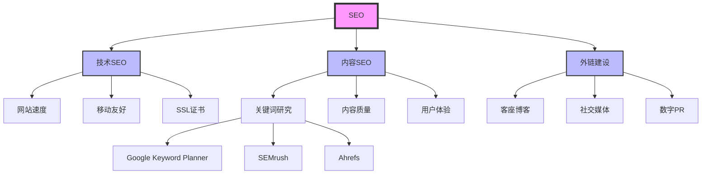

## 功能说明

### 核心功能
**实体提取与知识图谱构建**从内容中自动识别关键实体（概念、人物、组织、地点、事件），分析实体间关系，生成 Mermaid 格式的知识图谱，并提供完整的 Schema.org JSON-LD 标记。

### 使用场景
- 为博客文章生成结构化数据
- 构建主题权威性和内容集群
- 优化 AI 对内容的理解
- 创建可视化的知识图谱

## 执行流程

### 步骤 1: 内容读取和预处理
- 读取文件内容
- 去除 HTML 标签（如果是网页）
- 分段和分句

### 步骤 2: 实体识别
使用 NLP 规则识别：
```bash
# 识别专有名词（大写开头）
grep -oE '\b[A-Z][a-z]+\b' content.md

# 识别技术术语
grep -oE '\b[A-Z]{2,}\b' content.md

# 识别数字和统计数据
grep -oE '\b\d+[%]?\b' content.md

# 识别定义语句
grep -E '(是|定义为|是指|refers to|means)' content.md
```

### 步骤 3: 实体分类
- **人物** (Person): 作者、专家、名人
- **组织** (Organization): 公司、机构
- **概念** (Concept): 专业术语、方法、技术
- **地点** (Place): 城市、国家、地区
- **事件** (Event): 会议、发布、更新

### 步骤 4: 关系提取
- **is-a** (继承): "SEO 是一种营销策略"
- **part-of** (组成): "关键词研究是 SEO 的一部分"
- **related-to** (相关): "SEO 与内容营销相关"
- **impacts** (影响): "技术 SEO 影响网站速度"

### 步骤 5: 知识图谱构建
生成 Mermaid 格式的知识图谱

### 步骤 6: Schema.org 生成
根据实体类型生成相应的 JSON-LD

## 输出示例

```markdown
# 🧠 实体提取与知识图谱

## 分析内容：blog/post.md

**提取时间：** 2024-01-15
**识别实体：** 15 个
**关系类型：** 6 种

---

## 📊 核心实体识别

### 主要概念（Concept）

#### 1. SEO ⭐
- **类型：** 概念
- **定义：** 搜索引擎优化
- **出现频率：** 42 次
- **相关实体：**
  - 包含 → 技术SEO、内容SEO、外链建设
  - 相关 → 营销策略、数字营销
  - 影响 → 网站排名、有机流量

#### 2. 关键词研究
- **类型：** 概念
- **定义：** 识别和选择目标关键词的过程
- **出现频率：** 18 次
- **相关实体：**
  - 属于 → SEO
  - 使用 → 关键词工具、Google Keyword Planner
  - 目标 → 搜索意图、长尾关键词

#### 3. Backlink
- **类型：** 概念
- **同义词：** 外链、入站链接
- **出现频率：** 15 次
- **相关实体：**
  - 影响 → 域名权威度、搜索排名
  - 来源 → 客座博客、社交媒体、目录

### 组织（Organization）

#### 1. SEMrush
- **类型：** 组织/公司
- **关系：**
  - 提供 → SEO 工具
  - 相关 → Ahrefs、Moz

---

## 🔗 知识图谱



### 实体关系说明
- **粗线边框** = 核心概念
- **细线边框** = 子概念
- **箭头** = 关系方向

---

## 📝 Schema.org 标记生成

### 1. Article Schema（推荐）

```json
{
  "@context": "https://schema.org",
  "@type": "Article",
  "headline": "SEO 完全指南：从入门到精通",
  "description": "深入理解搜索引擎优化的核心概念和实践方法",
  "author": {
    "@type": "Person",
    "name": "张三",
    "jobTitle": "高级 SEO 专家",
    "credential": "Google 认证 SEO 专家"
  },
  "publisher": {
    "@type": "Organization",
    "name": "Your Company",
    "logo": {
      "@type": "ImageObject",
      "url": "https://yoursite.com/logo.png"
    }
  },
  "datePublished": "2024-01-15",
  "dateModified": "2024-01-15",
  "mainEntityOfPage": {
    "@type": "WebPage",
    "@id": "https://yoursite.com/seo-guide"
  },
  "about": [
    {
      "@type": "Thing",
      "name": "SEO",
      "description": "搜索引擎优化"
    },
    {
      "@type": "Thing",
      "name": "技术SEO",
      "description": "网站技术优化"
    },
    {
      "@type": "Thing",
      "name": "内容SEO",
      "description": "内容优化策略"
    }
  ],
  "keywords": "SEO, 搜索引擎优化, 技术SEO, 内容SEO, 外链建设"
}
```

### 2. FAQPage Schema

```json
{
  "@context": "https://schema.org",
  "@type": "FAQPage",
  "mainEntity": [
    {
      "@type": "Question",
      "name": "什么是 SEO？",
      "acceptedAnswer": {
        "@type": "Answer",
        "text": "SEO（Search Engine Optimization）是..."
      }
    },
    {
      "@type": "Question",
      "name": "SEO 需要多长时间见效？",
      "acceptedAnswer": {
        "@type": "Answer",
        "text": "通常 3-6 个月可见明显效果..."
      }
    }
  ]
}
```

### 3. BreadcrumbList Schema

```json
{
  "@context": "https://schema.org",
  "@type": "BreadcrumbList",
  "itemListElement": [
    {
      "@type": "ListItem",
      "position": 1,
      "name": "首页",
      "item": "https://yoursite.com"
    },
    {
      "@type": "ListItem",
      "position": 2,
      "name": "博客",
      "item": "https://yoursite.com/blog"
    },
    {
      "@type": "ListItem",
      "position": 3,
      "name": "SEO 指南",
      "item": "https://yoursite.com/seo-guide"
    }
  ]
}
```

---

## 💡 实体优化建议

### 1. 核心实体强化
**问题：** "SEO" 概念定义不够明确

**建议：**
```markdown
## 什么是 SEO？

**SEO（Search Engine Optimization）** 是通过优化网站的内容、结构和技术，提高其在搜索引擎结果页面（SERP）中排名的过程。

**核心目标：**
- 提高有机搜索流量
- 改善用户体验
- 增强网站权威性

**三大支柱：**
1. **技术 SEO** - 优化网站技术基础
2. **内容 SEO** - 创建高质量内容
3. **外链建设** - 建立权威性链接
```

### 2. 实体关系清晰化
**建议：** 使用明确的关联词
```markdown
✅ **好的示例：**
- SEO **包含** 技术SEO、内容SEO、外链建设
- 关键词研究 **属于** SEO 的一部分
- 外链建设 **影响** 域名权威度

❌ **不好的示例：**
- SEO 和技术SEO
- 关键词研究、SEO
- 外链建设影响排名
```

### 3. Schema.org 标记完整化
**建议：** 添加所有必需字段
```json
{
  "@context": "https://schema.org",
  "@type": "Article",
  "headline": "必须包含",
  "author": "必须包含",
  "datePublished": "必须包含",
  "publisher": "必须包含",
  "about": "推荐包含（帮助 AI 理解主题）",
  "keywords": "推荐包含（关键词关联）"
}
```

---

## 📋 实施清单

### 立即添加到页面
- [ ] 复制生成的 Schema.org JSON-LD 到页面 `<head>`
- [ ] 验证 Schema.org 标记（https://validator.schema.org/）
- [ ] 优化核心实体的定义

### 本周完成
- [ ] 完善所有相关实体的描述
- [ ] 建立内部链接网络
- [ ] 更新知识图谱

### 持续优化
- [ ] 监控新的实体出现
- [ ] 定期更新关系
- [ ] 测试 AI 理解效果

---

**数据文件：** `.claude-flow/cache/reports/geo/entities-20240115.json`
**Schema 验证：** https://validator.schema.org/
```

## 使用示例

```bash
# 自动检测 Schema 类型
/geo-entity-extraction post.md

# 指定 Article 类型
/geo-entity-extraction post.md --format Article

# 生成 FAQPage Schema
/geo-entity-extraction faq.md --format FAQPage

# 提取网页实体
/geo-entity-extraction https://example.com
```

## 相关命令
- `/geo-content-audit` - 完整 GEO 审计
- `/structured-data` - 生成其他 Schema 类型
- `/seo-audit` - 传统 SEO 审计
